# E203_common_pjt

## 1인가구의 희망

Piece Of Cake

## 목차

- 1. 주제 및 기간
  
  2. 기획 의도 및 컨셉
  
  3. 어플리케이션 기능
  
  4. 개발 환경 및 사용 기술
  
  5. ERD
  
  6. WireFrame
  
  7. API
1. 주제 및 기간
   
   - 모바일 어플리케이션 개발
   
   - 2022.07.05 ~ 2022.08.19

2. 기획 의도 및 컨셉
   
   - 사회 전반적으로 1인가구는 가파른 증가폭을 보이고 있음
   
   - 대용량 생필품을 소비하는 게 더 경제적이지만 1인가구가 대용량 생필품을 소비하기에는 양도 많고 가격도 저렴하지 않음
   
   - 혼자서 장을 보러 갔는데, 참외가 10kg에 만원이라 덥석 사버리고 말았을 때
   
   - 이왕 사버린거 주위에 사는 주민들이랑 나누고 더치페이를 하면 좋을 것 같은데,
   
   - 혹은 같이 사면 쌀 것 같은데,
   
   - 혹은 혼자 배달시켜먹기에는 최소주문금액이나 배달비가 부담될 것 같은데,
   
   - 같이 할 파티원 없나?
   
   - 
   
   - 생필품을 소분하거나, 함께구매하거나, 배달음식을 함께 시켜서 경제적인 부담을 덜고 싶을 때 사용할 어플리케이션 서비스 Cong

3. 어플리케이션 기능
   
   - 소분파티
     
     - 이미 구매한 생필품의 양이 너무 많고 처치가 곤란할 때
       
       - gps를 사용하여 동단위로 생필품을 소분할 파티를 모집
       
       - 구매영수증 / 구매내역을 파티모집 게시글에 첨부할 수 있도록 하여 파티를 생성하는 사람을 사용자들이 신뢰할 수 있게
       
       - 무료 나눔도 가능하게 (나눔 시 회원 레이팅 증가, 뱃지 부여 등으로 사용자의 참여를 유도)
       
       - 주의점 : 거래가능품목에 한하여 파티를 모집할 수 있게 해야함 (수제 음식물, 건강기능식품, 의약품, 주류, 유류는 거래불가능)
   
   - 나눠파티
     
     - 혼자 사기에는 너무 양이 많거나 가격이 비쌀 때
       
       - 파티를 생성하는 호스트가 제시한 랑데뷰 포인트에서 물품을 나눠 가질 의향이 있는 파티를 모집
       
       - 타임딜 형식 (ex) 24시간안에 파티가 모이지 않을 시 파티 파괴) (현재 보류)
       
       - gps를 사용하여 배달파티보다는 더 넓은 범위로 파티를 검색
       
       - 공동구매는 생필품이나 공산품일 경우가 많을테니 시간이 흐를수록 물품의 가치가 빠르게 떨어지는 배달과는 달리 넓은 범위의 파티를 구해도 괜찮을 것이라는 판단
       
       - ex) 1 + 1 옷 살건데 한 장만 필요할 때
       
       - ex) 마요컵밥 30개
   
   - 배달파티
     
     - 1인 가구에서 최소주문금액을 맞추기 어렵거나 배달비가 부담되지만 배달음식은 먹고 싶을 때
       
       - 파티를 생성하는 호스트가 제시한 랑데뷰 포인트에서 배달음식을 나눠 가질 의향이 있는 파티를 모집
       
       - 타임딜 형식 (ex) 3시간 안에 파티가 모이지 않을 시 파티 생성 취소) (현재 보류)
       
       - gps를 사용하여 나눠파티보다는 더 좁은 범위로 파티를 검색
       
       - 배달 음식의 경우 시간이 지나면 식거나 식감이 변하는 등 상품가치의 변화가 크기 때문에 최대한 가까운 사용자들끼리 파티 생성이 가능하도록 함
       
       - 배달 파티의 경우 2인 파티로 제한함, 보다 직관적인 서비스를 위함
   
   - 결제
     
     - 모든 결제는 직접 만나서 계좌이체 / 현금거래 
     
     - 카카오페이 api를 사용한 결제기능 구현
   
   - 위시리스트
     
     - 위시리시트 등록과 위시리스트만 볼 수 있는 페이지 추가
   
   - 신고
     
     - 도배글, 광고글, 혹은 개인정보를 요구하는 등의 악성 사용자들을 다른 사용자들이 인지할 수 있도록 신고 기능과 회원 레이팅 기능 추가

4. 개발환경 및 사용기술
   
   - Backend
     
     - SpringBoot
     
     - JPA
   
   - Frontend
     
     - Flutter
     
     - Dart
     
     - Android Studio

5. ERD
   
   

6. WireFrame
   
   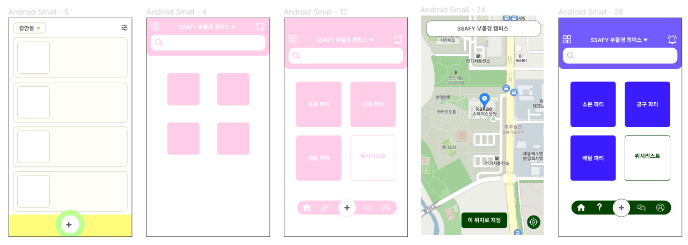
   
   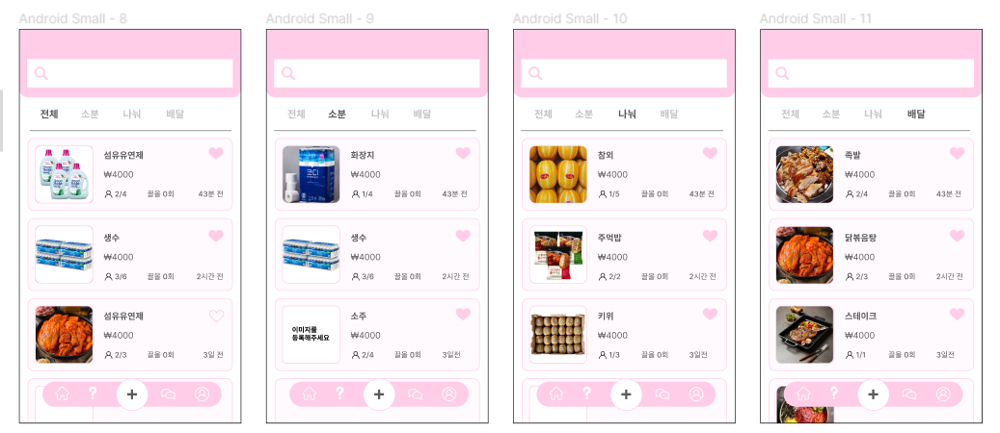
   
   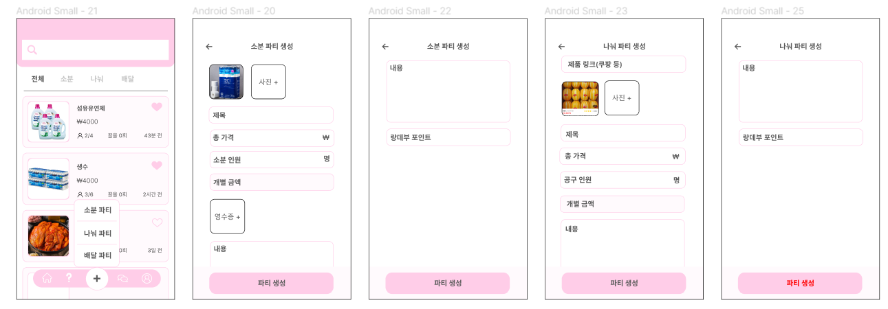
   
   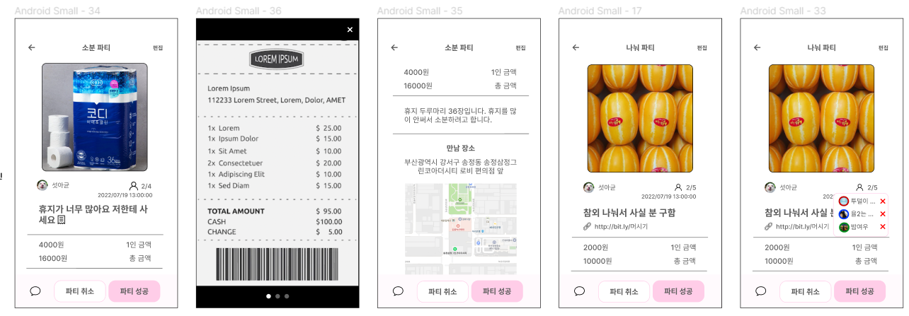
   
   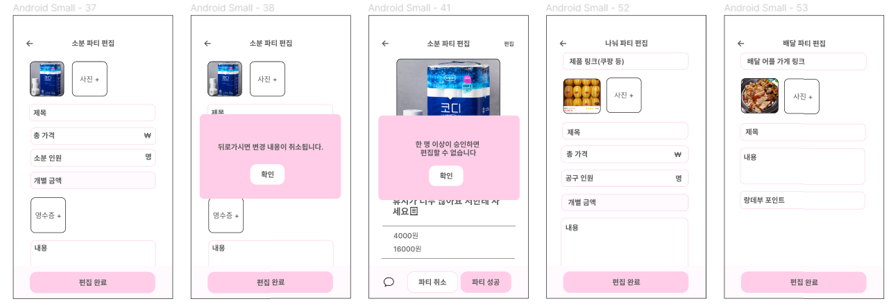
   
   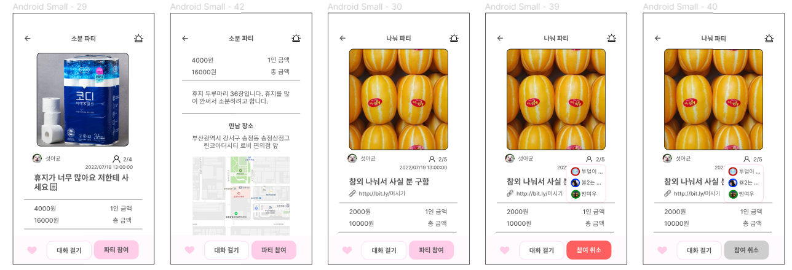
   
   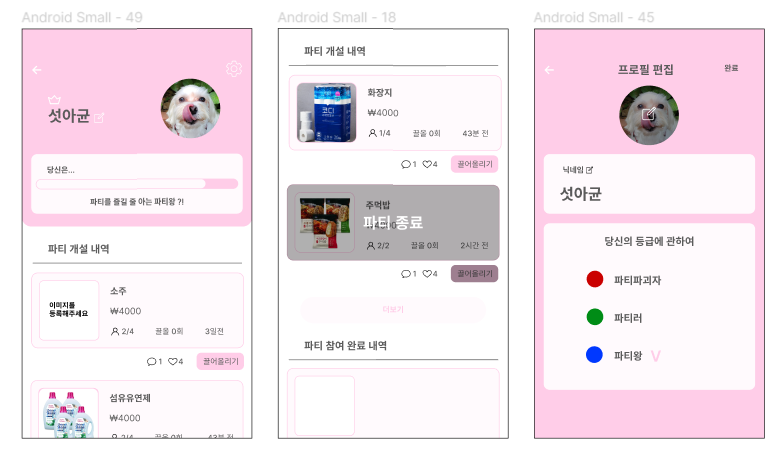
   
   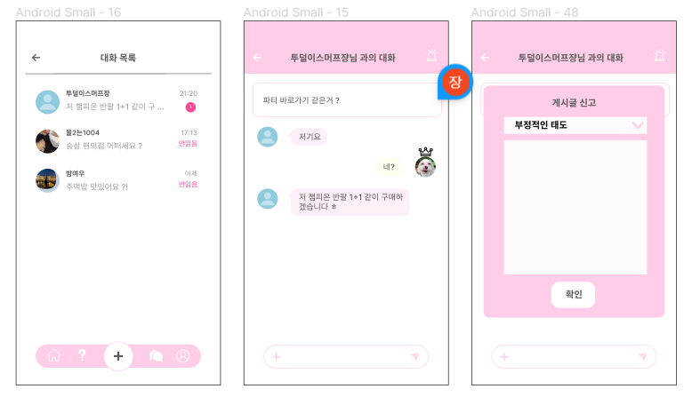

7. API URI 정리
   
   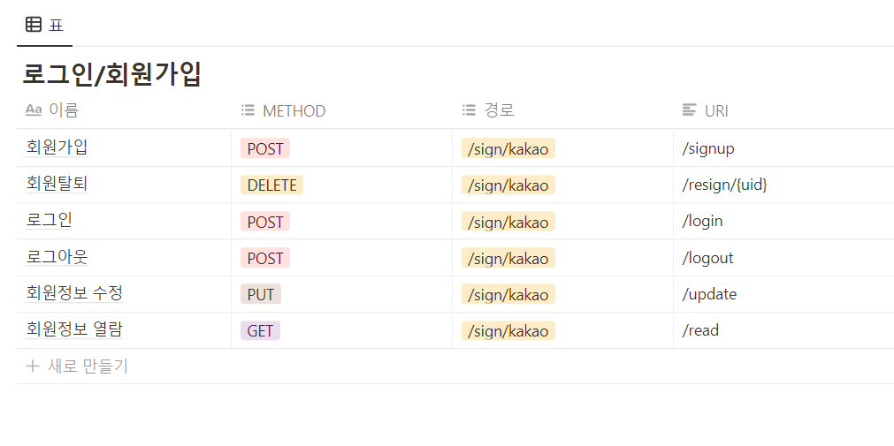
   
   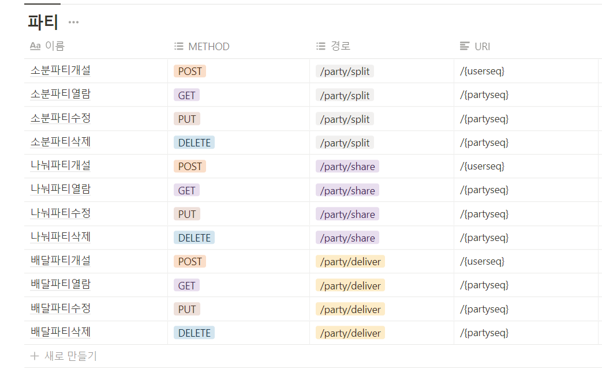
   
   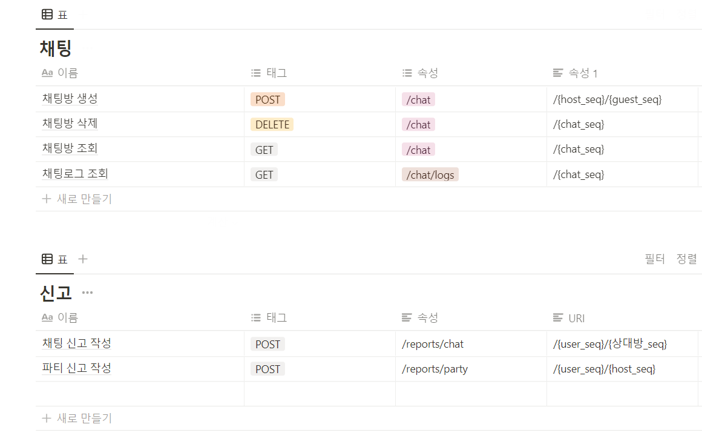
   
   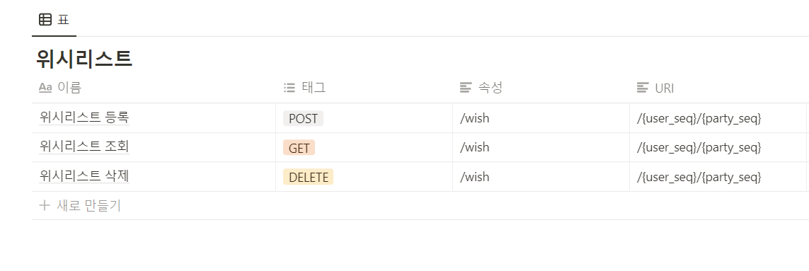
